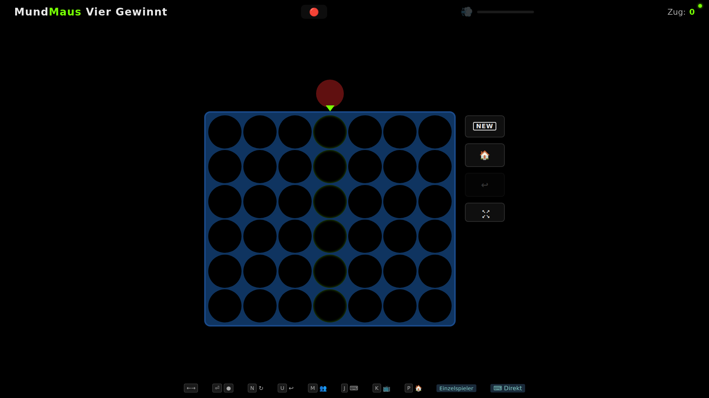
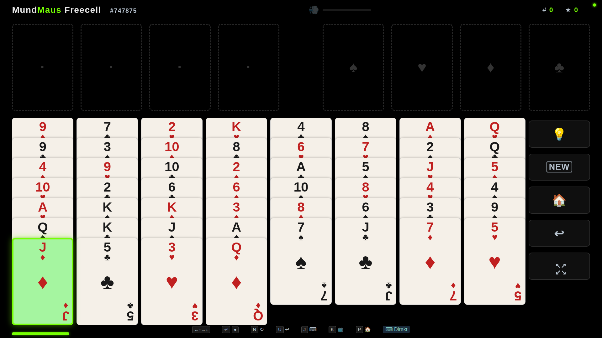
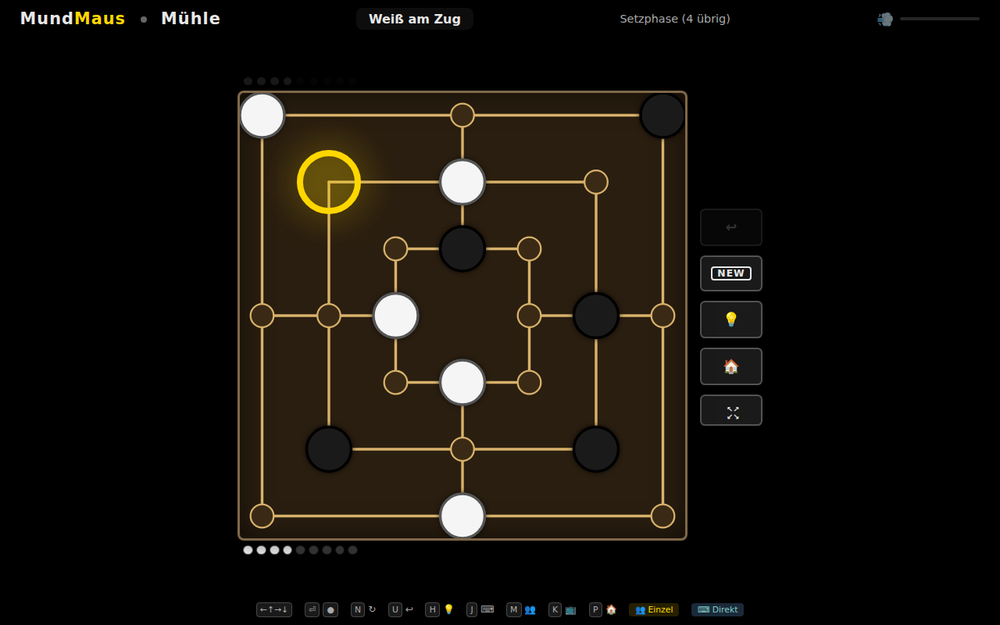
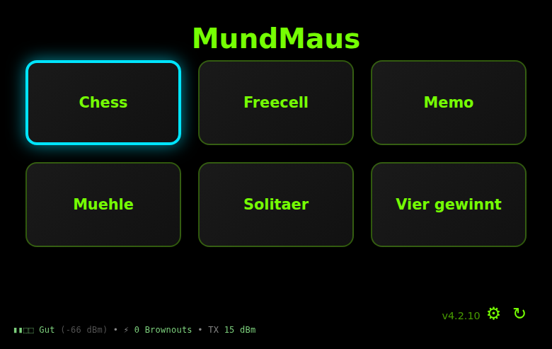
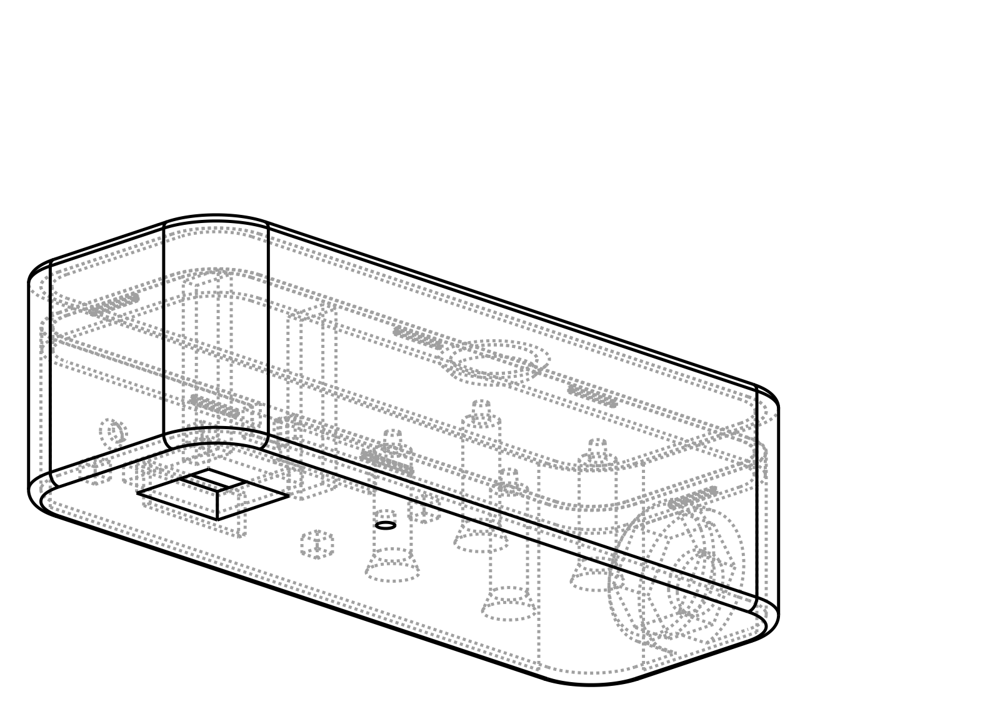

# MundMaus

**Mundgesteuerte Spieleplattform fuer Menschen mit Tetraplegie.**

Ein ESP32 mit Joystick und Drucksensor steuert browserbasierte Spiele — pusten statt klicken, Joystick statt Maus. Kein Internet, keine App. Nur WLAN und ein Browser.

Kosten: ~25 EUR | Aufbauzeit: ~30 Minuten | Nur der Drucksensor muss geloetet werden

     

 

## So funktioniert es

1. ESP32 liest Joystick (Lippe/Zunge) + Drucksensor (Pusten)
2. Sendet Befehle per WebSocket an den Browser
3. Browser zeigt Kartenspiele auf TV/Monitor
4. Alles laeuft lokal — kein Internet noetig

```
   Joystick ──┐
               ├── ESP32 ──── WiFi ──── Browser (TV/Monitor)
Drucksensor ──┘                          6 Spiele (Solitaer, Schach, Freecell, Memo, Muehle, Vier gewinnt)
```

## Spiele

| Spiel | Beschreibung |
|-------|-------------|
| **Solitaire** | Klondike mit Undo, Auto-Solve, 3 Schwierigkeitsstufen |
| **Schach** | Gegen Computer, 4 Schwierigkeitsstufen |
| **Memo** | Memory-Spiel, 4 Feldgroessen |
| **Vier Gewinnt** | Connect Four gegen KI, 3 Schwierigkeitsstufen |
| **Freecell** | Freecell Solitaire mit Supermove und Auto-Complete |
| **Mühle** | Nine Men's Morris gegen KI, 3 Schwierigkeitsstufen, mit Multiplayer |

Alle Spiele sind barrierefrei: farbenblind-sichere Markierungen, Audio-Feedback, Kiosk-Modus fuer den Patienten, Keyboard-Fallback fuer Pfleger.

### Portal & Einstellungen

Das **Spiele-Portal** erscheint automatisch wenn man die ESP32-Adresse im Browser oeffnet — alle Spiele auf einen Blick, WiFi-Status, Software-Updates.

Die **Einstellungen** (⚙) erlauben Pflegern, Joystick-Empfindlichkeit, Puste-Staerke und Geschwindigkeit per Slider anzupassen — ohne technische Kenntnisse.

### OTA Auto-Update

Neue Spiele und Firmware-Updates werden automatisch ueber WiFi heruntergeladen. Beim Einschalten prueft der ESP32 ob Updates verfuegbar sind — ein Klick im Portal installiert sie. Bei fehlgeschlagenem Update: automatischer Rollback auf die vorherige Version.

### Verbindungs-Diagnose



Unten links im Portal zeigt eine Status-Zeile jederzeit den Zustand des Geraets:

```
▮▮▮▯ Sehr gut (-63 dBm) • ⚡ 0 Brownouts • TX 15 dBm
```

- **Signal-Balken + Klartext** (Ausgezeichnet / Sehr gut / Gut / Ausreichend / Schwach) — keine dBm-Kenntnisse noetig, Detail in Klammern fuer Interessierte
- **Brownout-Zaehler** — zaehlt automatische Resets durch USB-Spannungsabfaelle. Bei > 0 erscheint ein Banner oben mit Handlungsempfehlung (kuerzeres/dickeres USB-Kabel, besseres Netzteil)
- **TX-Level** — aktueller WLAN-Sendepegel. Firmware reduziert automatisch in Stufen (15 → 13 → 11 → 8.5 → 7 dBm), falls Brownouts auftreten, um den Strom-Peak unter die kritische Schwelle zu druecken

Zusaetzlich loggt die Firmware Boot-/Connect-Events persistent auf Flash — abrufbar unter `http://<geraet>/api/wifi-log` (auch im AP-Fallback-Mode erreichbar). Damit lassen sich Cold-Boot-Probleme auch nachtraeglich diagnostizieren, ohne dass ein Laptop am Seriell-Port haengen muss.

## Was du brauchst

### Einkaufsliste

| # | Komponente | ca. Preis | Beispiel |
|---|-----------|-----------|----------|
| 1 | ESP32-WROOM-32 DevKit *oder* ESP32-S3 DevKitC (mit Pins!) | ~8 EUR | AZ-Delivery ESP32 DevKitC V4 |
| 2 | KY-023 Joystick Modul | ~3 EUR | AZ-Delivery KY-023 |
| 3 | Drucksensor MPS20N0040D-S + HX710B | ~5 EUR | eBay/AliExpress "MPS20N0040D HX710B" |
| 4 | DuPont Jumper-Kabel (M-M + M-F) | ~3 EUR | 40 Stueck Set |
| 5 | Micro-USB Kabel (Daten, nicht nur Laden!) | ~3 EUR | Beliebig |
| 6 | Silikonschlauch 4mm Innendurchmesser | ~3 EUR | Aquarium-Zubehoer |

**Gesamtkosten: ~25 EUR** — DuPont-Kabel zusammenstecken. Nur der Drucksensor (HX710B) muss geloetet werden.

Die Firmware erkennt das Board beim Booten automatisch und setzt die Pin-Belegung entsprechend (ESP32-WROOM vs. ESP32-S3) — gleiches Binary, kein manuelles Umbauen.

> **Gehaeuse:** Ein 3D-druckbares Gehaeuse ist enthalten (`enclosure/`). Ohne 3D-Drucker: Komponenten einfach mit DuPont-Kabeln verbinden — fertig.



### Mundstueck

Das 3D-druckbare Mundstueck sitzt auf dem Joystick-Stift. Ein Silikonschlauch geht seitlich ab und fuehrt zum Drucksensor — leichtes Pusten = Klick.

CAD-Modell (OnShape): [Mundstueck oeffnen](https://cad.onshape.com/documents/95d3a4d6faad26c25a2f7521/w/612dd5f1a9d3cf74ba406bb7/e/fc37b7a7abf844a33ef56714)

### Halterung

Das Gehaeuse wird in eine handelsueblliche **Mikrofonklemme** auf einem **Mikrofon-Bodenstaender** eingespannt (wie fuer Musiker). Der Staender steht neben dem Bett und positioniert den Joystick vor dem Mund des Patienten. Alternative: ein **Schwanenhals-Tischstaender** fuer kleinere Aufbauten.

> **Wichtig:** Das USB-Kabel muss ein **Datenkabel** sein, nicht nur ein Ladekabel! Datenkabel haben 4 Adern (2 Strom + 2 Daten), Ladekabel nur 2. Im Zweifel: wenn der Computer das ESP32 nicht erkennt, anderes Kabel probieren.

### Verkabelung

```
ESP32 DevKitC V4          KY-023 Joystick         HX710B + Drucksensor
┌─────────────────┐       ┌─────────────┐         ┌─────────────┐
│                 │       │             │         │             │
│  3V3 ───────────┼───────┤ +5V         │         │             │
│  GND ───────────┼───┬───┤ GND         │    ┌────┤ GND         │
│                 │   │   │             │    │    │             │
│  GPIO33 ────────┼───┼───┤ VRX         │    │    │             │
│  GPIO35 ────────┼───┼───┤ VRY         │    │    │             │
│  GPIO21 ────────┼───┼───┤ SW          │    │    │             │
│                 │   │   └─────────────┘    │    │             │
│  GPIO32 ────────┼───┼──────────────────────┼────┤ DATA        │
│  GPIO25 ────────┼───┼──────────────────────┼────┤ CLK         │
│  3V3 ──────────┼───┼──────────────────────┼────┤ VCC         │
│                 │   └──────────────────────┘    │             │
│       USB ──────┤                               │   Schlauch  │
│  (Strom+Daten)  │                               │   zum Mund  │
└─────────────────┘                               └─────────────┘
```

**Wichtig: Beide Sensoren an 3V3 anschliessen, NICHT an 5V!** Der ESP32 ADC vertraegt maximal 3.3V. Bei 5V-Versorgung koennen die Sensorausgaenge die ADC-Pins stoeren und falsche Joystick-Eingaben verursachen.

**Schlauch-Anschluss:** Silikonschlauch auf den Barb (Nippel) des Drucksensors stecken. Das andere Ende haelt der Patient im Mund. Leichtes Pusten = Klick.

> Detaillierte Pin-Tabelle (inkl. ESP32-S3 und optionales Display): siehe [TECHNICAL.md](TECHNICAL.md)

## Firmware aufspielen

Zwei Firmware-Optionen — gleiche Features, gleiche Spiele:

| | MicroPython | Arduino C++ |
|---|---|---|
| Fuer wen | Einsteiger, schnelles Testen | Fortgeschrittene, mehr Performance |
| RAM frei | ~80 KB | ~188 KB |
| OTA-Rollback | .bak-Dateien + Recovery-AP | Dual-Partition (automatisch) |
| Verzeichnis | `*.py` (Root) | `firmware/arduino/` |

### Option A: MicroPython (empfohlen fuer Einsteiger)

**Schritt 1:** Software installieren (einmalig, am Computer)
```bash
pip3 install esptool mpremote mpy-cross
```

**Schritt 2:** MicroPython auf den ESP32 flashen (einmalig)
```bash
# Firmware von micropython.org herunterladen:
# https://micropython.org/download/ESP32_GENERIC/
# Datei: ESP32_GENERIC-20251209-v1.27.0.bin

# ESP32 per USB anschliessen, dann:
esptool.py --chip esp32 --port /dev/ttyUSB0 erase_flash
esptool.py --chip esp32 --port /dev/ttyUSB0 --baud 460800 \
  write_flash -z 0x1000 ESP32_GENERIC-20251209-v1.27.0.bin
```

> **Windows:** Statt `/dev/ttyUSB0` den COM-Port verwenden (z.B. `COM3`). Im Geraetemanager nachschauen.

**Schritt 3:** MundMaus-Dateien hochladen
```bash
tools/upload-esp32.sh
```

Oder manuell:
```bash
mpremote connect /dev/ttyUSB0 cp boot.py main.py config.py :/
mpremote connect /dev/ttyUSB0 cp sensors.py server.py updater.py wifi_manager.py display.py :/
mpremote connect /dev/ttyUSB0 mkdir :www
mpremote connect /dev/ttyUSB0 cp games/solitaire.html games/chess.html games/memo.html games/settings.html games/vier-gewinnt.html games/freecell.html games/muehle.html :/www/
```

### Option B: Arduino C++ (mehr RAM, schneller)

```bash
cd firmware/arduino
pip install platformio

# Firmware kompilieren + flashen:
pio run -e esp32 -t upload

# Spieledateien flashen:
pio run -e esp32 -t uploadfs
```

## Erste Inbetriebnahme

1. **ESP32 per USB an Strom anschliessen** (USB-Ladegeraet oder Computer)
2. **Mit dem WLAN "MundMaus" verbinden** (Passwort: `mundmaus1`)
3. **Browser oeffnen:** `http://192.168.4.1`
4. **WLAN konfigurieren:** Im Portal das Heim-WLAN auswaehlen und Passwort eingeben
5. **ESP32 startet neu** und verbindet sich mit dem Heim-WLAN
6. **Beliebiges Geraet im gleichen WLAN** kann jetzt die Spiele oeffnen — entweder ueber die IP (im Seriell-Monitor) oder einfacher: **`http://mundmaus.local`** per mDNS. Funktioniert auf Apple-Geraeten nativ, auf Windows mit Bonjour Print Services, auf Linux mit avahi-daemon.

> **Fuer den TV:** Einen guenstigen Android-Stick (z.B. Xiaomi Mi TV Stick, ~30 EUR) an den TV anschliessen, Browser oeffnen, `mundmaus.local` eingeben. Oder einen alten Laptop/Tablet per HDMI an den TV.

## Einstellungen anpassen

Ueber das Portal (Zahnrad-Symbol ⚙) koennen Pfleger die Empfindlichkeit anpassen:

- **Joystick-Empfindlichkeit** — wie weit der Joystick bewegt werden muss
- **Puste-Staerke** — wie stark gepustet werden muss fuer einen Klick
- **Geschwindigkeit** — wie lang der Patient den Joystick halten muss bis der Cursor ein Feld weiterspringt (Standard 1000ms)

Aenderungen wirken sofort (Live-Preview). "Save" speichert dauerhaft, "Cancel" verwirft.

## Joystick-Auto-Kalibrierung

Jedes Einstecken der MundMaus startet mit einer automatischen Mittelpunkt-Kalibrierung:

1. Beim Boot liest die Firmware ~50 Joystick-Werte in einer halben Sekunde
2. Weicht der Joystick in dieser Zeit kaum ab (Spread < 300 ADC-Counts), wird der Mittelwert als neuer Nullpunkt uebernommen
3. Wackelt der Joystick zu stark (z.B. weil der Patient gerade das Mundstueck haelt), wird die Kalibrierung als ungueltig markiert — die Firmware uebernimmt den Wert trotzdem, damit ein klemmender Sensor nicht permanenten Ausschlag produziert

Konsequenz fuer den Pfleger: **Beim Anstecken das Mundstueck einen Moment loslassen.** Danach ist der Joystick zentriert — ohne Slider, ohne manuelles Trimmen. Falls der Cursor trotzdem in eine Richtung haengt: kurz MundMaus-Stecker ziehen, Joystick frei lassen, wieder einstecken — oder im Portal ueber den "Kalibrieren"-Button nachziehen.

## Kiosk-Modus fuer den Patient

Mit der Taste **K** wechselt jedes Spiel in den Kiosk-Modus: der Pfleger-Footer wird ausgeblendet, die grossen Action-Buttons (Neu / Zurueck / Tipp) bleiben sichtbar aber rechts vom Spielfeld, keine Menues sind erreichbar. So kann der Patient allein spielen, ohne versehentlich in Einstellungen oder Menues zu navigieren. Nochmal **K** blendet alles wieder ein.

## Keyboard-Shortcuts (Pfleger)

Fuer Pfleger, die die Spiele per Tastatur steuern oder testen wollen. Alle Spiele reagieren auf dieselbe Shortcut-Liste — sichtbar im Footer jedes Spiels:

| Taste | Funktion |
|-------|----------|
| Pfeiltasten | Navigation (links/rechts/oben/unten) |
| Leertaste / Enter | Auswaehlen / Klicken (wie Pusten) |
| **N** | Neues Spiel |
| **K** | Kiosk-Modus ein/aus |
| **J** | Joystick-Simulations-Modus (Charge-Mechanik statt sofortige Navigation) |
| **M** | Multiplayer-Modus (Schach, Vier gewinnt, Muehle) |

## Vorausschauende Navigation (Charge-Mechanik)

Damit der Patient die Kontrolle behaelt und nicht versehentlich ueber Karten hinwegspringt, nutzt die Navigation keine unsichtbaren Cooldowns sondern ein sichtbares Ladeprinzip:

1. Joystick in eine Richtung halten → das **Zielfeld** bekommt einen gruenen Rahmen der sich **im Uhrzeigersinn aufbaut** (wie ein Timer-Kreis, nur rechteckig)
2. Sobald der Rahmen geschlossen ist (~1 Sekunde), springt der Cursor dorthin
3. Joystick loslassen bevor der Rahmen voll ist → kein Sprung
4. **Analoge Joystick-Intensitaet**: leicht antippen = langsam laden, voll auslenken = schneller laden

Der Patient sieht also **immer vorher**, wohin der naechste Sprung geht und **wann** er passiert.

**Tastatur-Testmodus**: Mit **J** kann der Pfleger am Laptop zwischen Direktmodus (sofortige Navigation fuer Pflege) und Joystick-Simulation (Charge-Mechanik wie am Geraet) umschalten. Im Footer wird der aktuelle Modus als `⌨ Direkt` / `⌨ Sim` angezeigt.

**Multiplayer-Modus** (Schach, Vier gewinnt, Muehle): Mit **M** umschaltbar. Im Multiplayer spielt der Pfleger mit der Tastatur gegen den Patienten — beide nutzen die gleichen Eingabeformen, nur die KI wird durch den Pfleger ersetzt.

## Architektur

```
                        WebSocket :81
┌──────────────┐◄────────────────────────────►┌──────────────┐
│    ESP32     │         HTTP :80              │   Browser    │
│              │                               │   (TV/PC)    │
│  Joystick ───┤  ┌────────────────────────┐   │              │
│  Puff-Sensor─┤  │ Portal (/)             │──►│  Solitaire   │
│  WiFiManager │  │ Games (/www/*.html.gz) │   │  Schach      │
│  WS-Server   │  │ Settings (/www/settings│   │  Memo / ...  │
│  OTA Updater │  │ REST API (/api/*)      │   │  Settings    │
└──────────────┘  └────────────────────────┘   └──────────────┘
```

## Projektstruktur

```
mundmaus/
├── boot.py, main.py, config.py, ...  # MicroPython Firmware
├── sensors.py           # Joystick + Drucksensor (HX710B)
├── server.py            # HTTP/WebSocket Server + Portal
├── games/
│   ├── solitaire.html   # Klondike Solitaire
│   ├── chess.html        # Schach
│   ├── memo.html         # Memory/Memo
│   ├── vier-gewinnt.html # Vier Gewinnt (Connect Four)
│   ├── freecell.html     # Freecell Solitaire
│   ├── muehle.html       # Muehle (Nine Men's Morris)
│   └── settings.html     # Einstellungen
├── firmware/arduino/     # Arduino C++ Firmware (Alternative)
├── enclosure/            # 3D-Gehaeuse (CadQuery, druckfertig)
├── tools/                # Deploy- und Build-Scripts
├── website/              # mundmaus.de Webseite (separat)
└── TECHNICAL.md          # Hardware-Details, Protokolle, Raspberry Pi Setup
```

## FAQ

**Das ESP32 wird nicht erkannt (kein COM-Port):**
Anderes USB-Kabel versuchen! Viele Kabel sind reine Ladekabel ohne Datenleitungen.

**Die Spiele laden langsam:**
Normal beim ersten Laden — die Dateien werden komprimiert uebertragen (gzip). Danach schneller.

**Der Puff-Sensor reagiert nicht:**
Schlauch pruefen — ist er richtig auf dem Sensor-Nippel? Kein Knick im Schlauch? In den Einstellungen (⚙) die Puste-Empfindlichkeit erhoehen.

**Der Joystick springt:**
In den Einstellungen (⚙) die Empfindlichkeit reduzieren. Bei starkem WiFi-Ruckeln: ESP32 naeher an den Router stellen.

**Wie komme ich auf das ESP32 wenn ich die IP vergessen habe?**
`http://mundmaus.local` probieren (mDNS — funktioniert in allen Apple-Geraeten nativ). Wenn das nicht geht: ESP32 aus- und wieder einstecken. Wenn es kein WLAN findet, startet es automatisch den Hotspot "MundMaus" (Passwort: `mundmaus1`). Dann: `http://192.168.4.1`

**Das WLAN hat sich geaendert, wie sage ich das der MundMaus?**
Im Portal den Zahnrad-Button oeffnen und unter "WLAN" neue Credentials eintragen. Alternativ (wenn das alte WLAN gar nicht mehr da ist): einen POST an `http://mundmaus.local/api/wifi/reset` schickt — loescht gespeicherte Credentials, ESP32 rebootet in den AP-Fallback-Modus, dann wie bei der Erstinbetriebnahme neu konfigurieren.

**Was passiert wenn ein Firmware-Update schief geht?**
Zwei Sicherheitsnetze:
1. **Dual-Partition-Rollback** (Arduino-Firmware): ESP32 bootet nach einem fehlgeschlagenem Update automatisch auf die vorherige Version zurueck — transparent, ohne manuelles Eingreifen.
2. **Recovery-AP** (MicroPython-Firmware): Nach 3 fehlgeschlagenen Boot-Versuchen startet die Firmware den AP-Fallback "MundMaus" und stellt die Vorversion aus `.bak`-Dateien wieder her.

In beiden Faellen ist das Geraet ueber den Portal-Zugriff weiter erreichbar — kein Ziegelstein-Risiko beim Update.

## Mitmachen

Neue Spiele? Bug gefunden? Pull Requests willkommen! Alle Spiele sind einzelne HTML-Dateien in `games/` — HTML + CSS + JS in einer Datei, keine Build-Tools noetig.

Spiel-Design-Richtlinien: [games/STANDARDS.md](games/STANDARDS.md)

## Lizenz

AGPL-3.0 — siehe [LICENSE](LICENSE)

Basiert auf [mibragri/mouthMouse](https://github.com/mibragri/mouthMouse).
